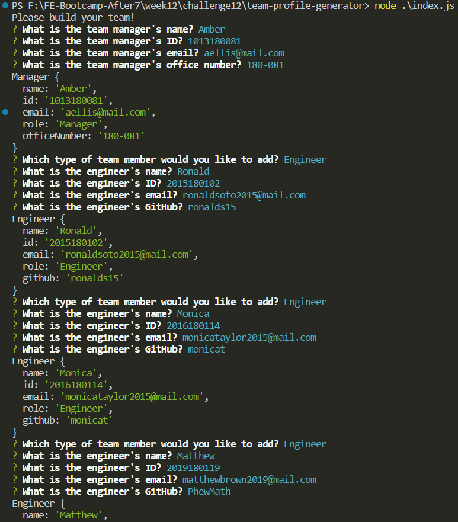
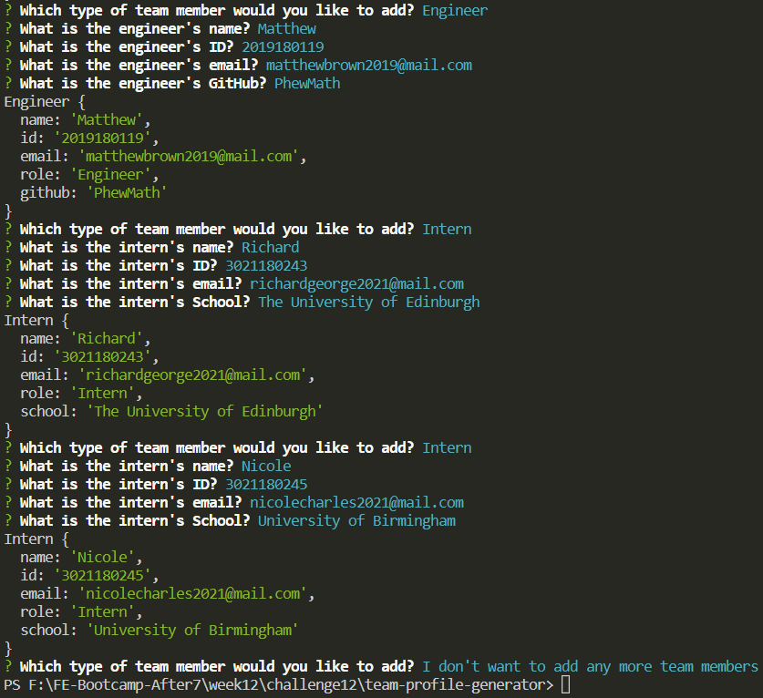
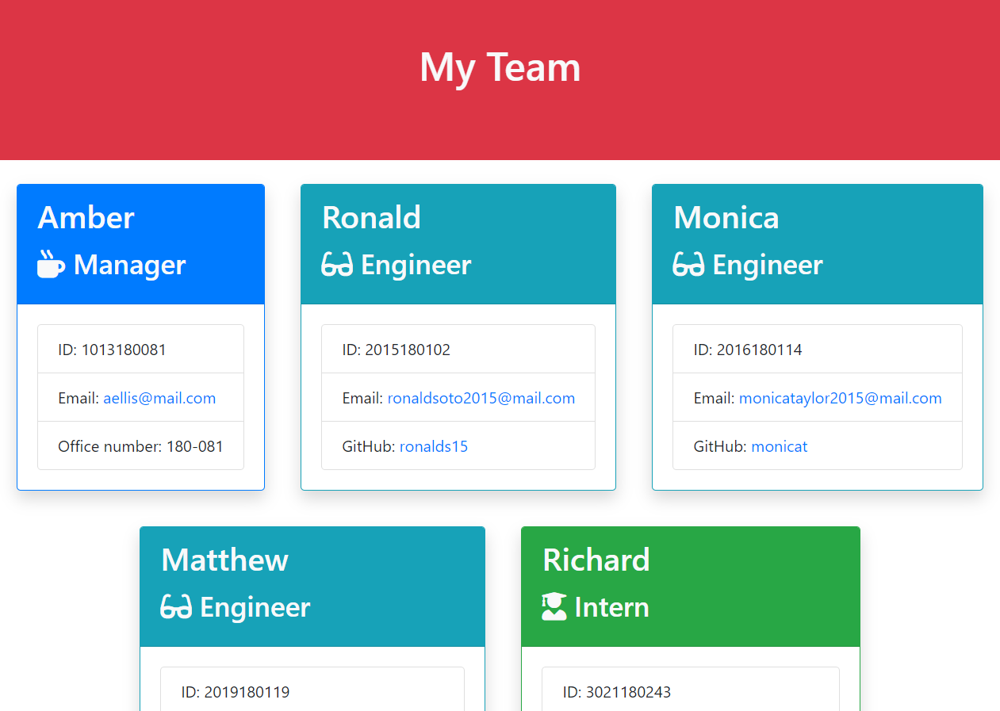

# TEAM-PROFILE-GENERATOR


## Description

A Node.js CLI application. Read user input and convert that into a team profile page.

### Table of Contents

- [TEAM-PROFILE-GENERATOR](#team-profile-generator)
  - [Description](#description)
    - [Table of Contents](#table-of-contents)
  - [Installation](#installation)
  - [Usage](#usage)
  - [License](#license)
  - [Contributions](#contributions)
  - [Tests](#tests)
  - [Questions](#questions)

## Installation

To install necessary dependencies, run the following command:

``` bash
npm install
```

## Usage

This project is about generating a manager-engineer coding team profiles. The sample HTML is deployed [here](https://v7lanw.github.io/team-profile-generator/).

To run it, install dependencies first with `npm install`, then type

``` bash
node ./index.js
```

and follow the steps in CLI.




then you got it!



## License

MIT License

- [Commercial use](https://choosealicense.com/appendix/#commercial-use): 🟢 The licensed material and derivatives may be used for commercial purposes.
- [Distribution](https://choosealicense.com/appendix/#distribution): 🟢 The licensed material may be distributed.
- [Modification](https://choosealicense.com/appendix/#modifications): 🟢 The licensed material may be modified.
- [Private use](https://choosealicense.com/appendix/#private-use): 🟢 The licensed material may be used and modified in private.
- [License and copyright notice](https://choosealicense.com/appendix/#include-copyright): 🔵 A copy of the license and copyright notice must be included with the licensed material.
- [Liability](https://choosealicense.com/appendix/#liability): 🔴 This license includes a limitation of liability.
- [Warranty](https://choosealicense.com/appendix/#warranty): 🔴 This license explicitly states that it does NOT provide any warranty.

## Contributions

We are going to support more teams (like designers team or musicians teams). Welcome to fork and develop, if you have more ideas, using issues or pull requests!

## Tests

To test all cases, run the following command:

``` bash
npm test
```

## Questions

If you have any questions about the repo, open an issue or contact me directly (v7lanw@hotmail.com).

You can find more of my work at [V7lanw's niches](https://github.com/V7lanw?tab=repositories).
